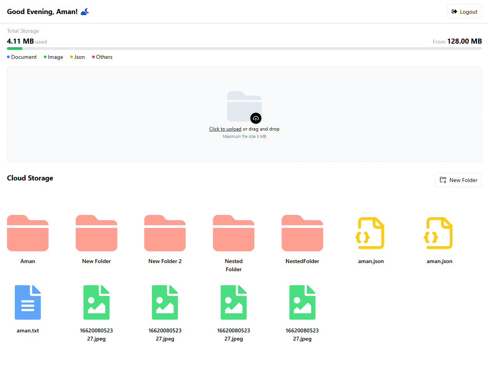

<h2 align="center">
     File Uploader
    <br />
</h2>

<div align="center">
    
</div>

A file uploader application built with React and Tailwind CSS for the frontend, and Express with MongoDB for the backend. It supports file uploads to AWS, structured storage, and JWT-based authentication. You can find the deployed website [here](https://your-app-url.com).

# Table of Contents

* [Pre-requisites](#pre-requisites)
* [Installation and Setup](#installation-and-setup)
* [Features](#features)
* [Tech Stack](#tech-stack)

## Pre-requisites

Before proceeding, ensure that your system meets the following requirements:

- [Node.js](https://nodejs.org/en/download/) (v18+ is required)
- [MongoDB](https://www.mongodb.com/try/download/community) (for local database setup)

## Installation and Setup

### Frontend  
- Navigate to the frontend folder and run the following commands:

```bash
# Install dependencies
npm i

# Serve with hot reload at localhost:3000
npm start
```

### Backend  
- Navigate to the backend folder and run the following commands:

```bash
# Install dependencies
npm i

# Serve with hot reload at localhost:3000
npm run dev
```

### Features
- <b>Folder structure:</b> Files are organized in a structured manner.
- <b>Match preview:</b> Displays file previews before upload.
- <b>Supported file types:</b> .json, .jpg, .png, .txt.
- <b>AWS Upload:</b> Files are uploaded to Amazon S3 storage.
- <b>Storage limit:</b> Implemented restrictions on upload size.
- <b>JWT-based authentication:</b> Secure login system using JSON Web Tokens.
- <b>Strctured code:</b> Clean and modular codebase for easy maintenance.

## Tech Stack

### Frontend
- <b>React:</b> - Frontend library
- <b>Tailwind CSS:</b> - CSS framework
- <b>React Icons:</b> - Icon Library
- <b>Context API:</b> - For managing global state

### Backend
- <b>Node:</b> - Backend Environment
- <b>Express:</b> - Routing framework
- <b>Mongoose:</b> - MongoDB library
- <b>Multer, Multer S3:</b> - File upload
- <b>AWS:</b> - Cloud for upload

